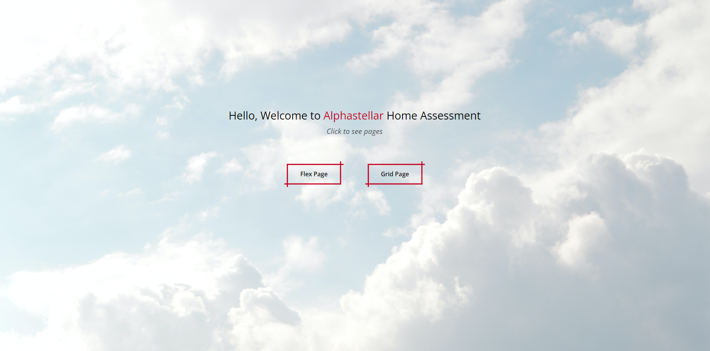
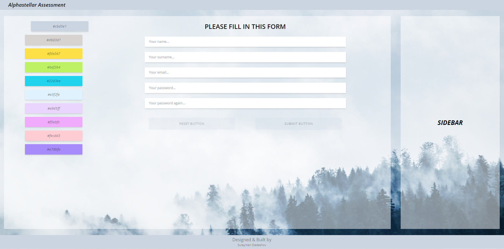

# Alphastellar Home Assessment

### The <b>React</b> javascript library and the <b>Tailwind</b> CSS library are used in this website.

- The <b>"react-router-dom"</b> library is used to manage the router structure.

- <b>Yup</b> library was used for form validation processes. Yup is a javaScript schema builder for value parsing and validation

- The animations are seen on the site come from the tailwind config file.

- There are two pages with the same design. One is using display grid, the other is using flex feature. It is possible to switch to these pages from the home page.

 
 

 
 

